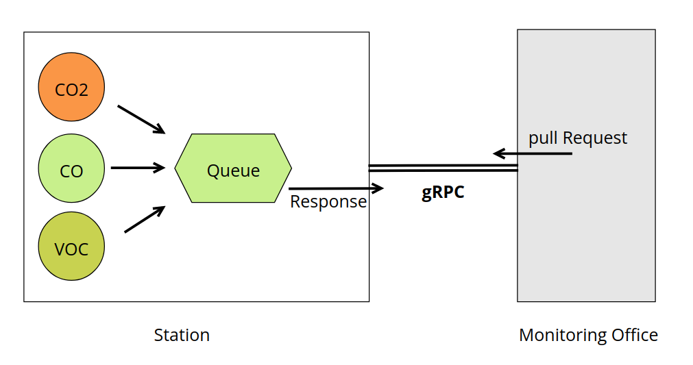
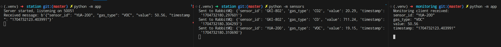

# Python Micro-Service

As you know there is different approach and protocols that can use to make communication over different services in micro-service architecture. In this simple project i want to show how we can do it over gRPC protocol in python.

<br>

## Project info

Suppose we have a factory or any working station with sensors that fetch the amounts of different gases in the air, and we want to monitor this data from a central monitoring office. This is exactly what this project aims to implement.

n the picture below, you can see that we have three sensors sending their data to a queue through **RabbitMQ**. On the other side, the Monitoring Office sends requests over the **gRPC** protocol to the station to fetch the data from the queue.

In a real-world scenario, you can enhance this workflow by integrating additional components such as time-series databases, various communication protocols, etc., in order to meet the project requirements.

<br>



<br>

## Run the project

After cloning the project and installing dependencies based on **requirements.txt**, it's time to kick off the project! 🚀    

First, let's get the station section ready. Navigate to the related folder and follow these commands:

```bash
cd station
```

```bash
# Start the RabbitMQ service:
docker-compose up -d

# Activate the sensors:
python -m sensors

# Open a new terminal and run the station gateway:
python -m app
```

Once the station is all set up, we can move on to the monitoring section and begin its service to fetch data:


```bash
cd monitoring
python -m app
```



<br>

## More detail

As it's clear, we utilized the gRPC package to establish communication between our two microservices. You can customize the data fields by making changes to the **sensors.proto** file. After each modification, you should rebuild the **sensors_pb2_grpc.py** and **sensors_pb2.py** using the following command. 

```bash
cd station/grpc_services
python -m grpc_tools.protoc -I=. --python_out=. --grpc_python_out=. ./sensors.proto
```

One more round! Due to the project's folder structure, after rebuilding, make sure to update the code in the **sensors_pb2_grpc.py** file to the suggested one:

```python
# change this
import sensors_pb2, sensors_pb2_grpc

# to this
from . import sensors_pb2, sensors_pb2_grpc
```

Please make sure that these three files are also copied to **monitoring/grpc_services** after the rebuild. 